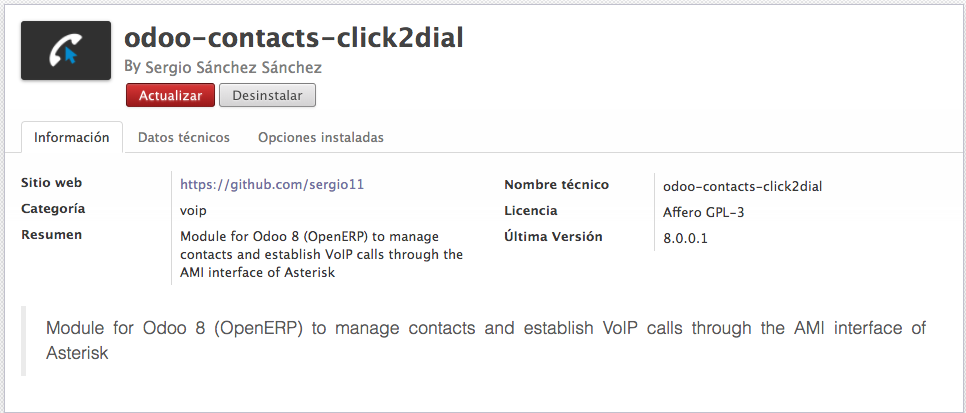
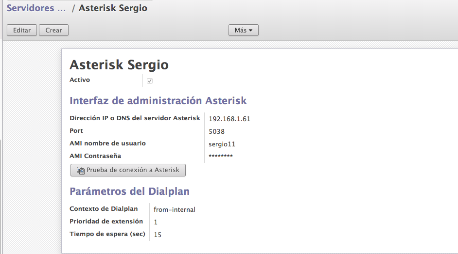
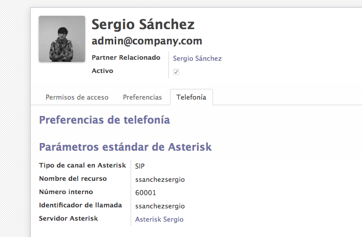
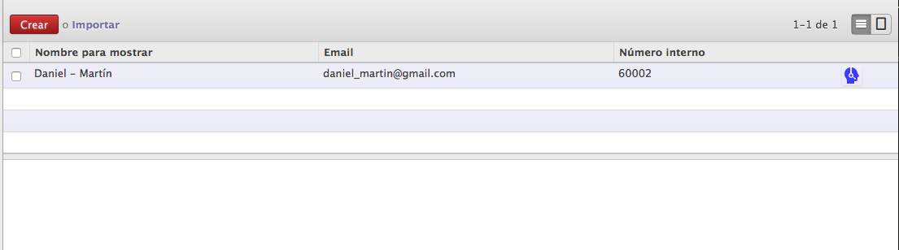
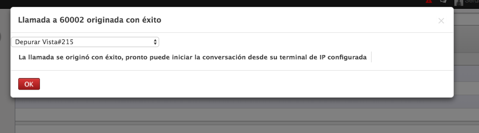
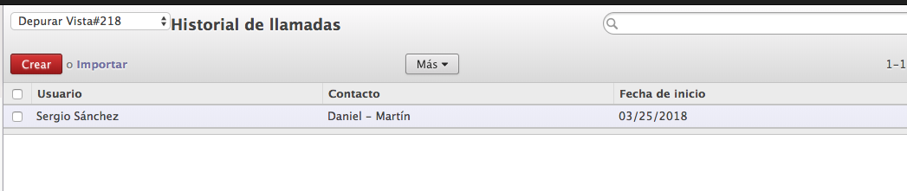

# odoo-contacts-click2dial
Module for Odoo 8 (OpenERP) to manage contacts and establish VoIP calls through the AMI interface of Asterisk

Allows **individual** configuration of each of the company's Asterisk servers

It allows to link the **SIP accounts** to the users of the company

Management of contacts and possibility to perform **"click2dial"** from the list

History of originated calls

